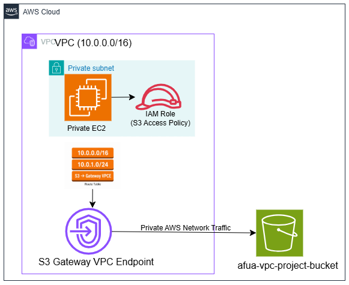
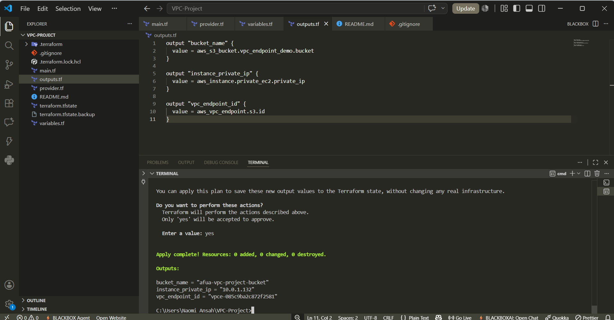
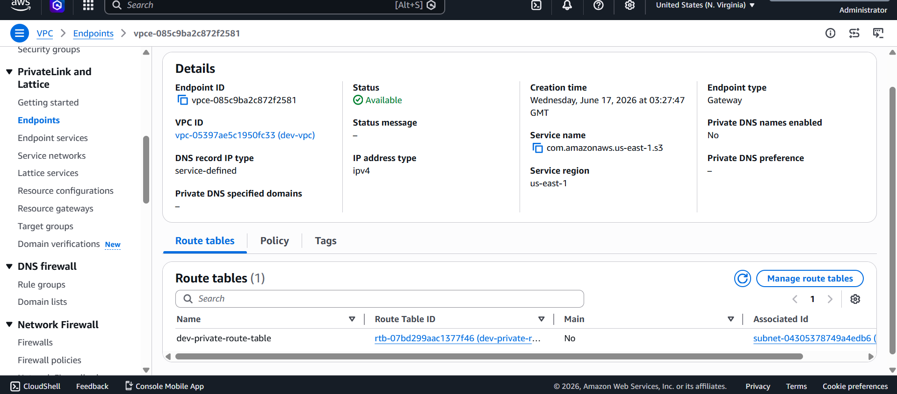
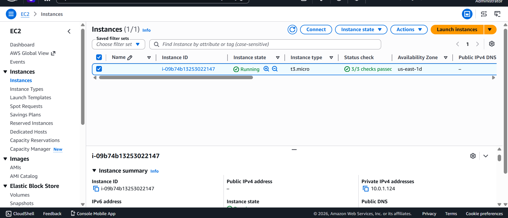
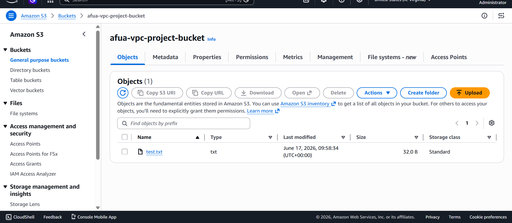

# Secure Backup Storage Using Amazon S3 Gateway VPC Endpoint

## Business Problem

Organizations frequently need to store backups, application logs, audit records, and sensitive business data in Amazon S3.

A common challenge is enabling private workloads to access Amazon S3 securely without exposing resources to the public internet or incurring additional NAT Gateway costs.

The objective of this project was to allow a private Amazon EC2 instance to upload files to Amazon S3 while ensuring:

- No Public IP addresses
- No Internet Gateway dependency
- No NAT Gateway dependency
- Secure access using IAM Roles
- Traffic remains within the AWS network

## Solution Overview

This project demonstrates how to provide secure and private connectivity between Amazon EC2 and Amazon S3 using an S3 Gateway VPC Endpoint.

The infrastructure was provisioned using Terraform and consists of:

- Amazon VPC
- Private Subnet
- Amazon EC2 Instance
- IAM Role and Instance Profile
- Route Table
- S3 Gateway VPC Endpoint
- Amazon S3 Bucket

The EC2 instance uses an IAM Role for authentication and uploads files directly to Amazon S3 through the Gateway VPC Endpoint without traversing the public internet.

## Architecture Diagram



### Architecture Components

| Component               | Purpose                            |
| ----------------------- | ---------------------------------- |
| Amazon VPC              | Provides network isolation         |
| Private Subnet          | Hosts the EC2 instance             |
| EC2 Instance            | Generates and uploads files        |
| IAM Role                | Grants secure access to S3         |
| Route Table             | Routes S3 traffic to the endpoint  |
| S3 Gateway VPC Endpoint | Enables private connectivity to S3 |
| Amazon S3 Bucket        | Stores uploaded files              |

### Traffic Flow

1. The EC2 instance runs inside a private subnet.
2. An IAM Role grants permissions to access Amazon S3.
3. The private route table contains a route to the S3 Gateway VPC Endpoint.
4. Traffic destined for Amazon S3 is routed through the endpoint.
5. The EC2 instance uploads a file to Amazon S3.
6. Traffic remains on the AWS private network.

## Infrastructure Deployment

Terraform was used to provision all infrastructure resources.

### Terraform Outputs



## VPC Endpoint Configuration

The S3 Gateway VPC Endpoint was associated with the private route table to provide secure access to Amazon S3.

### VPC Endpoint Details



## EC2 Instance Configuration

The EC2 instance was deployed in a private subnet with no public IP address.

An IAM Role was attached using an Instance Profile to provide secure access to Amazon S3 without storing access keys on the instance.

### Private EC2 Instance



## Validation

To validate the solution, a User Data script automatically created a test file and uploaded it to Amazon S3 during instance launch.

### User Data Script

```bash
#!/bin/bash

echo "Hello from VPC Endpoint Project" > test.txt

aws s3 cp test.txt s3://afua-vpc-project-bucket/
```

### S3 Upload Verification



### Validation Results

- EC2 launched successfully in a private subnet
- No public IP address assigned
- IAM Role attached successfully
- Gateway VPC Endpoint configured successfully
- File uploaded successfully to Amazon S3
- No NAT Gateway required
- No internet connectivity required

## Business Benefits

### Enhanced Security

Traffic remains within AWS private infrastructure and does not traverse the public internet.

### Cost Optimization

Eliminates the need for a NAT Gateway when accessing Amazon S3, reducing networking costs.

### Compliance Support

Supports workloads involving:

- Financial records
- Healthcare data
- Audit logs
- Backup storage
- Internal application data

### Scalability

Multiple private workloads can securely access Amazon S3 through the same Gateway VPC Endpoint.

## Terraform Features

- Infrastructure as Code (IaC)
- Dynamic Amazon Linux 2023 AMI lookup
- Reusable Terraform variables
- IAM least-privilege access model
- Automated validation using User Data
- Resource tagging using environment variables

## Key Learning Outcomes

Through this project I learned how to:

- Configure Amazon S3 Gateway VPC Endpoints
- Implement private AWS networking architectures
- Use IAM Roles and Instance Profiles securely
- Route AWS service traffic through VPC Endpoints
- Apply Infrastructure as Code using Terraform
- Reduce costs by eliminating NAT Gateway dependencies
- Validate secure connectivity between private workloads and Amazon S3

## Author

**Naomi Ansah**

AWS Certified Cloud Practitioner  
Aspiring Cloud Solutions Architect  
Cloud Engineer

GitHub:(https://github.com/Naomiansah)
LinkedIn: https://www.linkedin.com/in/naomi-ansah/
